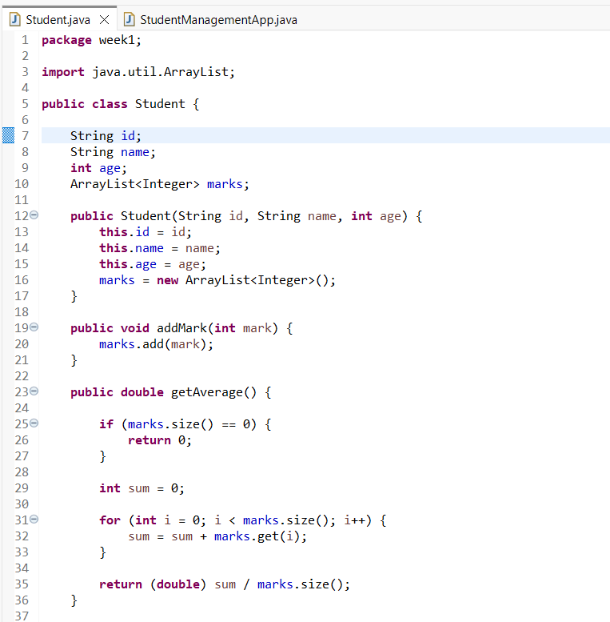

# week1# Student Management System

## Description
This project is a Java console application that manages student records. It allows users to add students, enter marks, display student information, search for students by ID, and find the student with the highest average.

## Features
- Add a new student
- Add marks to a student
- Display all students
- Search for a student by ID
- Calculate student average
- Find the highest average student

## Technologies Used
- Java
- Eclipse IDE
- Git
- GitHub

## Project Classes
- Student.java
- StudentManagementApp.java

## How to Run
1. Open the project in Eclipse.
2. Run `StudentManagementApp.java`.
3. Use the menu displayed in the console.

   
## ScreenShots

## Author
Maram Saleh Alyusef
Ejada co-op training week1
